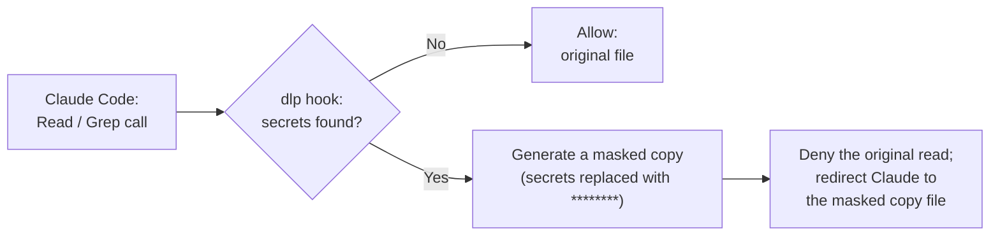

# claude-dlp

 

> Data-leak prevention for Claude Code — via hooks. …or mods, if you're feeling experimental.

A collection of harnesses for preventing confidential-information leaks from Claude Code.

## Structure

This repository develops two implementation approaches in parallel.

| Branch | Directory | Approach | Status |
|---|---|---|---|
| `main` | `.claude/` | Based on the official Claude Code hooks API | **latest** |
| `experimental` | `mods/` | Based on patching Claude Code itself | **experimental** |

`.claude/` is implemented using only the official hooks API. `mods/` directly rewrites Claude Code's own behavior,
aiming for stronger control than the hooks-based version, but it is an unofficial modification that may break with
future Claude Code upgrades.

If `mods` ever matures into something officially supportable, `experimental` will be promoted to `main`, and the
current `hooks` implementation will be preserved as `hooks-legacy` and discontinued.

## Installation

Copy this repository's `.claude/` directory into the root of your project. That's all it takes for it to work.

| Path | Contents |
|---|---|
| `.claude/settings.json` | The hook registration, plus a baseline `permissions.deny` that blocks `Read` of machine-wide credentials (`~/.ssh`, `~/.aws`, …) and `Bash` access to secret files named by convention (`*.env*`, `*.pem*`, `*id_rsa*`, …) |
| `.claude/hooks/dlp/` | The hook itself (see [`.claude/hooks/dlp/README.md`](.claude/hooks/dlp/README.md)) |

- If your project already has `.claude/settings.json`, don't overwrite it — merge the `hooks` and `permissions.deny`
  entries into it.
- Python 3.9+ is required (standard library only).
- **The default `target_dirs` is `.` (the whole repository), which is meant for trying the hook out.** For a real
  project, narrow it in `.claude/hooks/dlp/dlp.config.yaml` to the directories that actually hold config files and
  secrets (e.g. `src/main/resources`). Scanning the whole repository makes every `Read` of a
  `.properties`/`.yml`/`.json`/`.xml` file go through the scanner. It also makes a `Grep` content search over a large
  repository likely to hit the scan cutoff and be denied.

This repository applies its own `.claude/` to itself, so the hook is active while you work on it with Claude Code.

## .claude/hooks/dlp

A hook that blocks `Read` / `Grep` when they try to read a file containing confidential information, and redirects
to a masked copy instead.

(**Not shown above: if the scanner itself fails, times out, or the config is broken, the hook fails closed and
denies the read by default — it does not fall back to allowing it.**) See
[`.claude/hooks/dlp/README.md`](.claude/hooks/dlp/README.md) for the full decision flow (scope routing,
staleness checks, fail-closed behavior) and configuration details.
