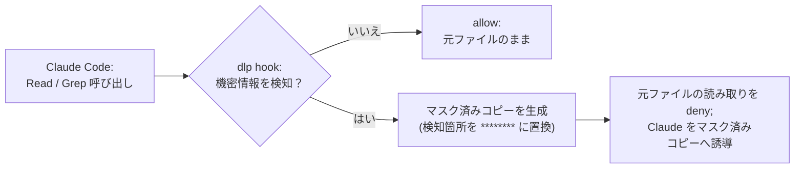

# claude-dlp

 

> Data-leak prevention for Claude Code — via hooks. …or mods, if you're feeling experimental.

Claude Code 向けの機密情報読み取り防止・漏洩防止ハーネス集。

## 構成

このリポジトリは2つの実装方式を並行して開発している。

| ブランチ | ディレクトリ | 実装方式 | 状態 |
|---|---|---|---|
| `main` | `.claude/` | Claude Code 公式 hooks API ベース | **latest** |
| `experimental` | `mods/` | Claude Code 本体への改造ベース | **experimental** |

`.claude/` は公式 hooks API のみで実装している。`mods/` は Claude Code 本体の挙動を直接書き換えるアプローチで、
hooks 版より強力な制御を狙っているが、Claude Code のバージョンアップで動作しなくなる可能性がある非公式な改造版。

`mods` が将来公式にサポートされる形で成立した場合、`experimental` を `main` に昇格し、
現行の `hooks` 版は `hooks-legacy` として履歴保存の上で discontinued とする。

## 導入方法

このリポジトリの `.claude/` ディレクトリを、導入先プロジェクトのルートにコピーする。それだけで動く。

| パス | 中身 |
|---|---|
| `.claude/settings.json` | hook の登録と、ベースラインの `permissions.deny`。マシン全体の資格情報（`~/.ssh`、`~/.aws` など）の `Read` と、命名規約に沿った秘密ファイル（`*.env*`、`*.pem*`、`*id_rsa*` など）への `Bash` アクセスを止める |
| `.claude/hooks/dlp/` | hook 本体（[`.claude/hooks/dlp/README_ja.md`](.claude/hooks/dlp/README_ja.md) を参照） |

- 導入先にすでに `.claude/settings.json` がある場合は上書きせず、`hooks` と `permissions.deny` の項目をマージする。
- Python 3.9 以降が必要（標準ライブラリのみ）。
- **`target_dirs` の既定値は `.`（リポジトリ全体）で、これはお試し用である。** 実プロジェクトに導入するときは、
  `.claude/hooks/dlp/dlp.config.yaml` で、設定ファイルや秘密が実際に置かれているディレクトリ（例: `src/main/resources`）に
  絞ること。リポジトリ全体を対象にすると、`.properties`/`.yml`/`.json`/`.xml` などを `Read` するたびにスキャナが走る。
  大きなリポジトリでは、`Grep` の content 検索が走査の打ち切りにかかって deny されやすくなる。

このリポジトリ自身にも `.claude/` を適用しているので、Claude Code で作業するときも hook が効いている。

## .claude/hooks/dlp

`Read` / `Grep` が機密情報を含むファイルを読もうとしたときにブロックし、マスク済みコピーへ誘導する hook。

（**上図には出ていないが、スキャナ自体が失敗・タイムアウトしたり設定が壊れている場合、この hook は
fail-closed で既定 deny となり、allow 側にフォールバックすることはない** 。 ）判定の詳細（スコープ判定・
鮮度チェック・fail-closed の挙動）や設定は
[`.claude/hooks/dlp/README_ja.md`](.claude/hooks/dlp/README_ja.md) を参照。
